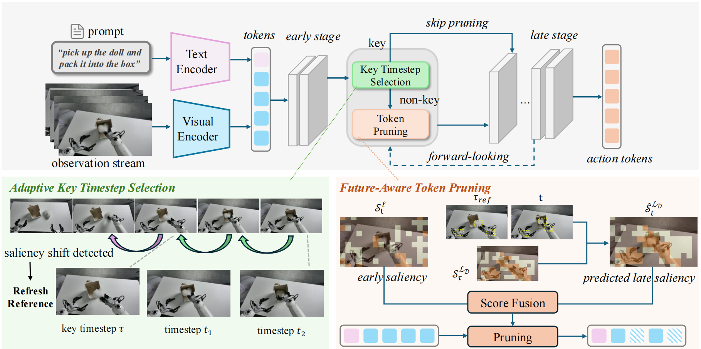

# <div align="center">SAFE-Pruner: Semantic Attention-Guided Future-Aware Token Pruning for Efficient Vision-Language-Action Manipulation (ECCV 2026)</div>

<div align="center">

[](https://msssl.github.io/SAFE-Pruner) [](https://arxiv.org/abs/2605.29662) [](LICENSE)

**Shilin Ma, Chubin Zhang, Changyuan Wang, Yuji Wang, Yue Wu, Zixuan Wang, Jingqi Tian, Zheng Zhu, Yansong Tang**

</div>

<div align="center">
  <strong>🔥 SAFE-Pruner is a training-free, plug-and-play token pruning framework for accelerating vision-language-action models.</strong>
</div>

---

## 🎯 Overview

This repository contains the official implementation of our **ECCV 2026** paper. We propose SAFE-Pruner, a semantic attention-guided and future-aware token pruning framework that improves the efficiency of vision-language-action manipulation by adaptively selecting key timesteps and retaining task-relevant visual tokens.

SAFE-Pruner identifies key timesteps from the observation stream and skips pruning when a fresh visual reference is needed. At non-key timesteps, it forecasts late-stage semantic saliency and fuses it with early attention to guide token pruning.

<div align="center">
  
</div>

---

## 🛠️ Installation

We recommend using an [Anaconda](https://www.anaconda.com/) environment with Python 3.10.

### 1. Create the environment

```bash
conda create -n safe-pruner python=3.10 -y
conda activate safe-pruner

# Install the PyTorch build appropriate for your system:
# https://pytorch.org/get-started/locally/
pip install torch torchvision torchaudio
```

### 2. Install LIBERO and project dependencies

Run the following from the repository root:

```bash
git clone https://github.com/Lifelong-Robot-Learning/LIBERO.git
pip install -e LIBERO
pip install -r src/openvla-oft/experiments/robot/libero/libero_requirements.txt

git clone --branch vla-cache-openvla-oft --single-branch \
  https://github.com/siyuhsu/transformers.git
mv modeling_llama.py transformers/src/transformers/models/llama/modeling_llama.py
pip install -e transformers

pip install -e src/openvla-oft
```

### 3. Install FlashAttention

```bash
pip install packaging ninja
ninja --version
pip install "flash-attn==2.5.5" --no-build-isolation
pip install "numpy==1.26.4"
```

---

## 🗂️ Checkpoints

SAFE-Pruner uses the four LIBERO-finetuned [OpenVLA-OFT checkpoints](https://huggingface.co/moojink/openvla-7b-oft-finetuned-libero-spatial):

```text
openvla_checkpoints/
├── openvla-7b-oft-finetuned-libero-10/
├── openvla-7b-oft-finetuned-libero-goal/
├── openvla-7b-oft-finetuned-libero-object/
└── openvla-7b-oft-finetuned-libero-spatial/
```

Set `CHECKPOINT_DIR` near the top of `src/openvla-oft/run_eval.sh` to the directory containing these checkpoints.

---

## 🚀 Evaluation

The first argument selects a LIBERO task suite; the second enables or disables SAFE-Pruner.

#### ▶️ Run evaluation with SAFE-Pruner:

```bash
cd src/openvla-oft
bash run_eval.sh libero_object True
```

#### ❌ Run baseline without SAFE-Pruner:

```bash
cd src/openvla-oft
bash run_eval.sh libero_object False
```

Supported task suites:

| Task suite     | Argument         |
| -------------- | ---------------- |
| LIBERO-Spatial | `libero_spatial` |
| LIBERO-Object  | `libero_object`  |
| LIBERO-Goal    | `libero_goal`    |
| LIBERO-10      | `libero_10`      |

To evaluate all four suites with and without SAFE-Pruner:

```bash
bash run_all_eval.sh
```

---

## 📖 Citation

If you find this work useful, please cite:

```bibtex
@article{ma2026safe,
  title={SAFE-Pruner: Semantic Attention-Guided Future-Aware Token Pruning for Efficient Vision-Language-Action Manipulation},
  author={Ma, Shilin and Zhang, Chubin and Wang, Changyuan and Wang, Yuji and Wu, Yue and Wang, Zixuan and Tian, Jingqi and Zhu, Zheng and Tang, Yansong},
  journal={arXiv preprint arXiv:2605.29662},
  year={2026}
}
```

---

## 🤝 Acknowledgements

We build on the amazing work of [OpenVLA-OFT](https://github.com/moojink/openvla-oft), [VLA-Cache](https://github.com/siyuhsu/vla-cache), and [VLA-Pruner](https://github.com/MINT-SJTU/VLA-Pruner).

---

## 📜 License

This project is licensed under the [MIT License](LICENSE).
